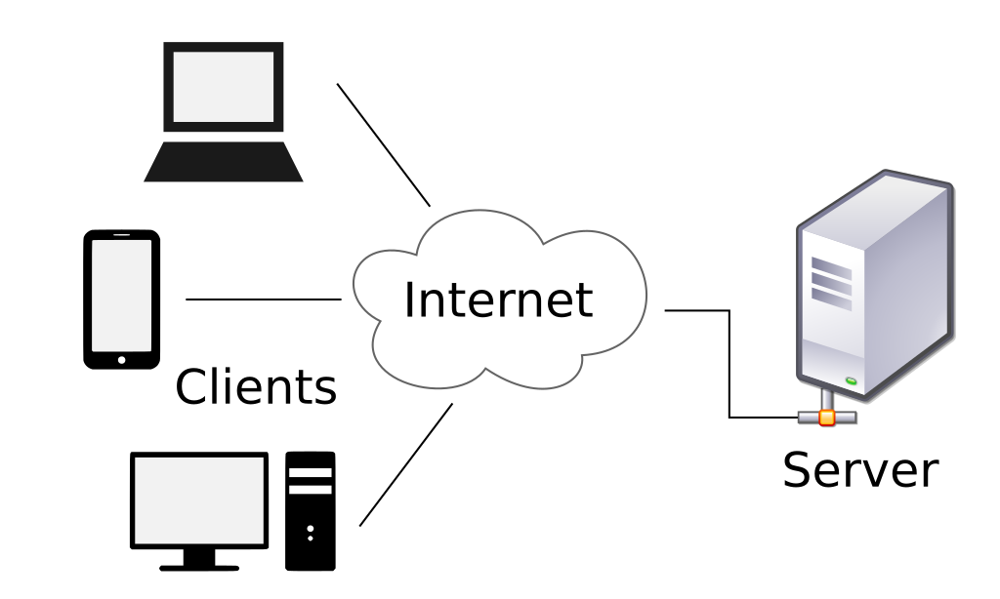

# 프론트엔드

# 목 차
- 웹개발 개념
- 프론트엔드와 백엔드
- 커리큘럼
- 기타

# 웹개발 개념

## 웹
commonly known as Web, is an information system enabling documents 
and otherweb resources to be accessed over the Internet.
## 웹개발
Web development is the work involved in developing a website 
for the Internet (World Wide Web) or an intranet(a private network).
## 서버와 클라이언트
Client-server model is a distributed application structure 
that partitions tasks or workloads 
between the providers of a resource or service, called servers, 
and service requesters, called clients.

# 프론트엔드와 백엔드
In software engineering, the terms frontend and backend 
refer to the separation of concerns between the presentation layer (frontend), 
and the data access layer (backend) of a piece of software, 
or the physical infrastructure or hardware.

# 프론트엔드 개발 환경

## 언어
- HTML: 데이터 표시
- CSS: 디자인
- JavaScript: HTML과 CSS를 조작하여 동적인 페이지 구성
## 라이브러리
- React, Vue, Angular

# 백엔드 개발 환경

## API Server 
PHP, Java
## DATABASE
MySQL, MongoDB

# 커리큘럼

## 일 3시간, 월 30시간, 6개월, 총 180시간
- 프론트엔드 1
HTML/CSS
- 프론트엔드 2
HTML/CSS
- 프론트엔드 3
JavaScript
- 프론트엔드 4
React
- 프론트엔드 5
소셜서비스 백엔드
- 프론트엔드 6
소셜서비스 프론트엔드

자세한 커리큘럼은 자료실에 올릴 예정

# 기타
- 수업방식
프로젝트 기반
- 수업자료
https://github.com/nigrojin/koreaIT 저녁반(화목화목금)
- 추천사이트
W3Schools, Google, stackoverflow

