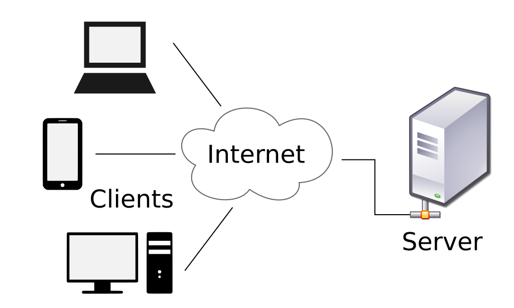

# 프론트엔드

# 목 차
- 웹개발 개념
- 프론트엔드와 백엔드
- 커리큘럼
- 기타

# 웹개발 개념
## 월드와이드웹(WWW)
일반적으로 Web이라고 부른다.
인터넷을 통해 문서나 기타 자료에 접근을 가능하게 만드는 정보 시스템이다

## 웹개발
인터넷(World Wide Web) 또는 인트라넷(Private network)용 웹 사이트를 만드는 것과 관련된 분야

## 서버와 클라이언트
- 서버
리소스 또는 서비스의 제공자
- 클라이언트
리소스 또는 서비스를 요청하는 사람(컴퓨터)

# 프론트엔드와 백엔드
- 프론트엔드
the presentation layer of software
- 백엔드
the data access layer of software

# 프론트엔드 개발 환경
## 언어
- HTML: 데이터 표시
- CSS: 디자인
- JavaScript: HTML과 CSS를 조작하여 동적인 페이지 구성
## 라이브러리
- React, Vue, Angular

# 백엔드 개발 환경
## API Server 
PHP, Java, Node.js
## DATABASE
MySQL, MongoDB

# 커리큘럼
## 일 3시간, 월 30시간, 6개월, 총 180시간
- 프론트엔드 1
HTML/CSS
- 프론트엔드 2
HTML/CSS
- 프론트엔드 3
JavaScript
- 프론트엔드 4
React
- 프론트엔드 5
소셜서비스 백엔드 (Node.js) 
- 프론트엔드 6
소셜서비스 프론트엔드 (React)

자세한 커리큘럼은 자료실에 올릴 예정

# 기타
- 수업방식
프로젝트 기반
- 수업자료
https://github.com/nigrojin/koreaIT 저녁반(화목화목금)
- 추천사이트
W3Schools, Google 검색, stackoverflow
- 질문 
nigrojin@naver.com 

